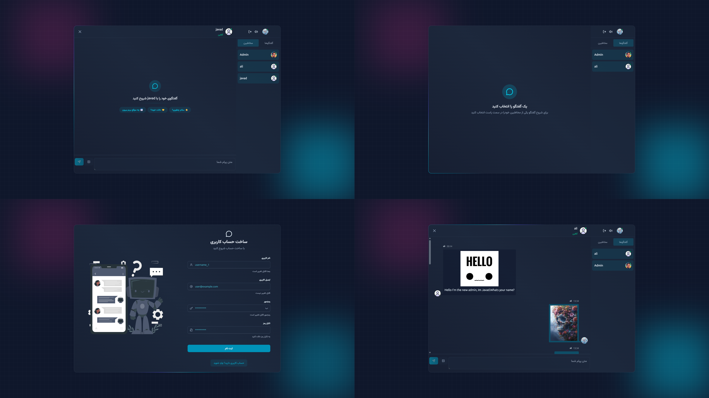

# Real-time Chat Application

A full-stack real-time chat application built with a React frontend and Node.js/Express backend, using MongoDB for data storage and Socket.IO for real-time communication.



## Project Overview

This is a modern chat application that allows users to register, login, and communicate with other users in real-time. The application features:

- User authentication (registration, login, session management)
- Real-time messaging using Socket.IO
- Image sharing capabilities
- Contact management
- Chat history
- Responsive UI with React and TailwindCSS

The application follows a monorepo structure with separate packages for the frontend (web) and backend (server).

## Project Structure

```
new-chat-app/
├── apps/
│   ├── server/          # Backend API and WebSocket server
│   └── web/             # Frontend React application
├── packages/            # Shared packages (eslint-config, typescript-config, ui)
├── package.json         # Root package with workspace definitions
└── turbo.json           # Turborepo configuration
```

### Server (Backend)

Located in `apps/server/`, the backend is built with Node.js, Express, and MongoDB:

- `src/config/` - Database configuration
- `src/constants/` - Application constants (error codes, HTTP status codes, etc.)
- `src/controllers/` - Request handlers for authentication and messaging
- `src/middleware/` - Express middleware for authentication, error handling, validation
- `src/models/` - MongoDB models (User, Message, Session, VerifyCode)
- `src/routes/` - API route definitions
- `src/services/` - Business logic implementations
- `src/types/` - TypeScript type definitions
- `src/utils/` - Utility functions (encryption, JWT, cookies, email, etc.)
- `src/index.ts` - Main application entry point

### Web (Frontend)

Located in `apps/web/`, the frontend is built with React, TypeScript, and TailwindCSS:

- `src/api/` - API client configuration
- `src/components/` - Reusable UI components
- `src/hooks/` - Custom React hooks
- `src/pages/` - Page components
- `src/routes/` - Routing configuration
- `src/store/` - Zustand state management
- `src/types/` - TypeScript type definitions
- `src/App.tsx` - Main application component

## Installation Instructions

### Prerequisites

- Node.js (v18 or higher)
- MongoDB instance (local or cloud)
- pnpm package manager

### Setup

1. Clone the repository:

```bash
git clone <repository-url>
cd new-chat-app
```

2. Install dependencies:

```bash
pnpm install
```

3. Set up environment variables:
    - Copy `apps/server/.env.example` to `apps/server/.env`
    - Fill in the required values:
        - `MONGO_URI` - Your MongoDB connection string
        - `PORT` - Server port (default: 5001)
        - `APP_ORIGIN` - Frontend URL (e.g., http://localhost:5173)
        - `JWT_ACCESS_SECRET` and `JWT_REFRESH_SECRET` - Secret keys for JWT
        - `CLOUDINARY_CLOUD_NAME`, `CLOUDINARY_API_KEY`, `CLOUDINARY_API_SECRET` - Cloudinary credentials for image uploads
        - `RESEND_API_KEY` - Resend API key for email functionality

### Development

To run the development servers:

```bash
# Run both frontend and backend in development mode
pnpm dev
```

This will start:

- Frontend development server on http://localhost:5173
- Backend API server on http://localhost:5001

### Production Build

To build for production:

```bash
# Build both frontend and backend
pnpm build
```

To start the production server:

```bash
# Start the backend server (serves both API and frontend)
pnpm start
```

## Usage Guidelines

### Authentication

1. Users must register for a new account or login with existing credentials
2. Sessions are managed with JWT tokens stored in cookies
3. Access tokens are automatically refreshed when expired

### Messaging

1. Select a contact from the contacts list or chats list
2. Type your message in the input field at the bottom
3. Press Enter or click the send button to send
4. Images can be sent by pasting image data or using the image upload feature

### API Endpoints

#### Authentication

- `POST /api/auth/register` - Register a new user
- `POST /api/auth/login` - Login with existing credentials
- `POST /api/auth/logout` - Logout and clear session
- `POST /api/auth/refresh` - Refresh access token
- `PATCH /api/auth/update` - Update user profile

#### Messaging

- `POST /api/message/send/:id` - Send a message to a user
- `GET /api/message/contacts` - Get all contacts
- `GET /api/message/:id` - Get messages with a specific user
- `GET /api/message/chats/partners` - Get chat partners

## Technologies Used

### Backend

- Node.js with Express
- MongoDB with Mongoose
- Socket.IO for real-time communication
- JWT for authentication
- Bcrypt for password hashing
- Cloudinary for image storage
- Resend for email services
- Zod for schema validation

### Frontend

- React with TypeScript
- TailwindCSS for styling
- React Router for navigation
- Zustand for state management
- Socket.IO Client for real-time communication
- React Hook Form for form handling
- Zod for client-side validation

## Contribution Guidelines

1. Fork the repository
2. Create a feature branch
3. Make your changes
4. Ensure tests pass
5. Submit a pull request

### Code Style

- Follow the existing code formatting
- Use TypeScript for type safety
- Write clear, concise commit messages
- Add comments for complex logic

## Troubleshooting

### Common Issues

1. **Connection to MongoDB fails**
    - Check your `MONGO_URI` in the `.env` file
    - Ensure your MongoDB instance is running

2. **CORS errors**
    - Verify `APP_ORIGIN` matches your frontend URL

3. **Authentication issues**
    - Check that JWT secrets are properly set in `.env`
    - Clear browser cookies and try again

### Getting Help

If you encounter issues not covered in this README:

1. Check the console logs for error messages
2. Verify all environment variables are set correctly
3. Ensure all dependencies are installed
4. Check if there are any network connectivity issues

## License

This project is licensed under the MIT License - see the LICENSE file for details.
